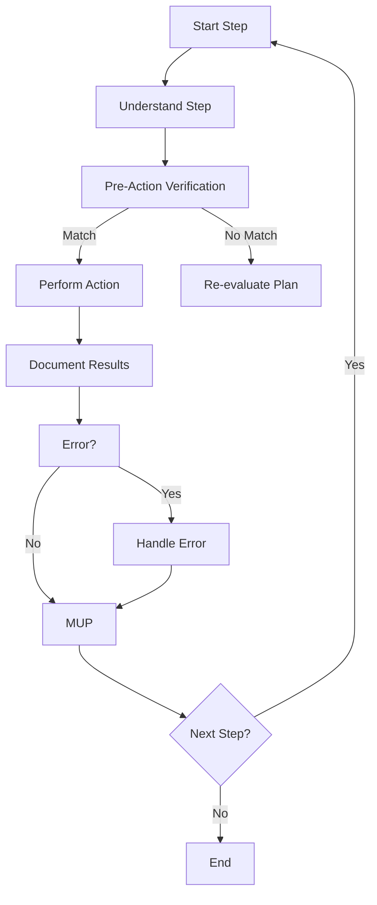

# **CRCT Execution Plugin**

╔═════════════════════════════════════════════════════════════╗
║                        EXECUTION                             ║
║                                                             ║
║  Verify  -->  Execute  -->  Document  -->  Update  -->  Next ║
║  State       Step         Results       Trackers      Step   ║
╚═════════════════════════════════════════════════════════════╝

## ENTERING/EXITING THIS PHASE

**Enter if**:
- `.clinerules` shows `current_phase: "Execution"`
- Transitioning from Strategy

**Exit when**:
- All steps in instruction files are executed
- Expected outputs are generated
- Results are documented

**Exit action**:
```
[LAST_ACTION_STATE]
last_action: "Completed Execution Phase - Tasks Executed"
current_phase: "Execution"
next_action: "Phase Complete - User Action Required"
next_phase: "Strategy"
```

## CONTEXT LOADING

1. Read core files:
   - `.clinerules`
   - `memory-bank/system_manifest.md`
   - `memory-bank/activeContext.md`
   - `memory-bank/module_relationship_tracker.md`
   - `memory-bank/changelog.md`
   - `memory-bank/progress.md`
   
2. Load applicable documents:
   - Implementation Plan document
   - Task Instruction document
   - Any referenced subtask documents
   - Dependency files identified from trackers

## STEP EXECUTION PROCESS

For each step in the instruction file:

1. **Pre-Action Verification** (CRITICAL)
   ```
   - Intended change: [describe the change]
   - Expected state: [what you expect]
   - Actual state: [what you found]
   - Validation: [MATCH/MISMATCH]
   ```
   ❗ **PROCEED ONLY IF STATES MATCH**

2. **Execute Step**
   - Perform the specified action
   - If an error occurs, document and resolve

3. **Document Results**
   ```
   [RESULTS]
   - Action completed: [description]
   - Outcome: [what changed]
   - Observations: [findings]
   - Issues encountered: [problems]
   [/RESULTS]
   ```

4. **Update Dependencies** (if needed)
   - Use `ADD_DEP(source, target, type)` to add new dependencies
   - Use `REMOVE_DEP(source, target, type)` to remove incorrect dependencies

5. **Update Step Status**
   - Mark step as completed in the instruction file:
     ```
     ## Steps
     1. ✅ [Step description]
     2. ⬜ [Step description]
     ```

6. **Apply MUP**
   - Complete all MUP steps
   - Update `.clinerules` with progress

## ERROR HANDLING PROTOCOL

When encountering errors:
1. Document the error condition
   ```
   [ERROR]
   - Error message: [exact message]
   - Context: [what you were doing]
   - Probable cause: [analysis]
   [/ERROR]
   ```

2. Determine resolution approach:
   - Retry with adjustments
   - Split into smaller steps
   - Revert and reconsider approach

3. Document resolution:
   ```
   [RESOLUTION]
   - Approach taken: [what you did]
   - Result: [outcome]
   - Preventative measures: [how to avoid this in future]
   [/RESOLUTION]
   ```

## SUBTASK HANDLING

When a step requires subtask execution:
1. Load subtask instruction file
2. Execute all steps in the subtask
3. Mark the parent task step as completed
4. Return to the parent task execution

## EXECUTION MUP

After each step execution:
1. Update Task Instruction document with step completion status
2. Update `activeContext.md` with action results and observations
3. Update `changelog.md` if significant changes were made
4. Update any related Domain Module documents if dependencies changed
5. Update `.clinerules`:
   ```
   [LAST_ACTION_STATE]
   last_action: "Completed Step X in Task Y"
   current_phase: "Execution"
   next_action: "Execute Step X+1"
   next_phase: "Execution"
   ```
6. Update `progress.md` with task completion percentage

## CHECKPOINTS BEFORE TRANSITION

[TRANSITION_CHECKLIST]
[ ] All steps in the instruction file are executed
[ ] All expected outputs are generated
[ ] Results and observations are documented
[ ] Instruction file is updated with step status
[ ] `.clinerules` updated with next_phase: "Strategy"
[/TRANSITION_CHECKLIST]

## DEPENDENCY OPERATIONS

Use these operations to maintain dependency tracking:
- `ADD_DEP(source, target, type)`: Add dependency
- `REMOVE_DEP(source, target, type)`: Remove dependency
- `ADD_MODULE(id, path)`: Add new module/file
- `REMOVE_MODULE(id)`: Remove obsolete module/file

## EXECUTION FLOWCHART


## MUP VERIFICATION FORMAT

After every action, include:

[MUP_VERIFICATION]
[X] 1. Updated activeContext.md with: [brief description]
[X] 2. Updated changelog.md: [Yes/No + reason]
[X] 3. Updated `.clinerules` with last_action: [action description]
[X] 4. Updated HDTA documents: [Yes/No + which ones]
[X] 5. Pre-action verification completed: [Yes/No + details]
[X] 6. Step results documented: [Yes/No + details]
[X] 7. Step status updated: [Yes/No + details]
[/MUP_VERIFICATION]