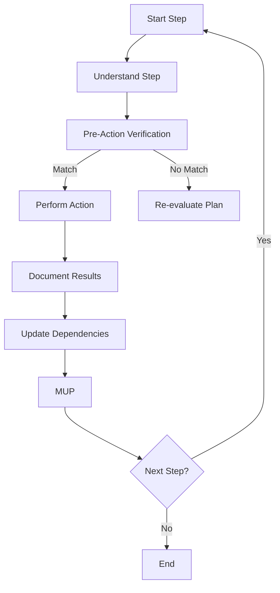

# **Simplified CRCT System - Execution Plugin**

**This Plugin provides detailed instructions for the Execution phase using JSON-based dependency tracking.**

---

## I. Entering and Exiting Execution Phase

**Entering Execution Phase:**
1. **`.memory-bankrules.json` Check**: Always read `.memory-bankrules.json` first. If `lastActionState.currentPhase` shows "Execution", proceed with these instructions.
2. **Transition from Strategy**: Enter after Strategy; `.memory-bankrules.json` `nextPhase` will be "Execution".
3. **User Trigger**: Start a new session post-Strategy or to resume execution.

**Exiting Execution Phase:**
1. **Completion Criteria:**
   - All steps in the instruction file(s) are executed.
   - Expected outputs are generated.
   - Results and observations are documented.
   - MUP is followed for all actions.
2. **`.memory-bankrules.json` Update (MUP):**
   - To return to Strategy:
     ```json
     {
       "lastActionState": {
         "lastAction": "Completed Execution Phase - Tasks Executed",
         "currentPhase": "Execution",
         "nextAction": "Phase Complete - User Action Required",
         "nextPhase": "Strategy"
       }
     }
     ```
   - For project completion:
     ```json
     {
       "lastActionState": {
         "lastAction": "Completed Execution Phase - Project Objectives Achieved",
         "currentPhase": "Execution",
         "nextAction": "Project Completion - User Review",
         "nextPhase": "Project Complete"
       }
     }
     ```
3. **User Action**: After updating `.memory-bankrules.json`, pause for user to trigger the next phase.

---

## II. Loading Context for Execution

**Action**: Load context for task execution.
**Procedure:**
- Load core files: `.memory-bankrules.json`, `projectbrief.md`, `productContext.md`, `activeContext.md`, `dependencies.json`, `changelog.md`
- Review `activeContext.md` for project state and priorities.
- Check `dependencies.json` for file and module dependencies.
- Load instruction file (`{task_name}_instructions.txt`), focusing on "Objective," "Context," "Dependencies," and "Steps".
- Load dependency files using the dependency information from `dependencies.json`.

---

## III. Executing Tasks from Instruction Files

**Action**: Execute the step-by-step plan in the instruction file.
**Procedure:**
1. **Iterate Through Steps:**
   - **Understand the Step**: Clarify the action required.
   
   - **Pre-Action Verification (MANDATORY)**: Before file modifications:
     ```javascript
     function verifyFileState(filePath, expectedPattern) {
       // Read the current file content
       let fileContent;
       try {
         fileContent = readFile(filePath);
       } catch (error) {
         // File doesn't exist, which might be expected for new files
         return { exists: false, matches: false, content: null };
       }
       
       // Check if content matches expectations
       const matches = expectedPattern ? fileContent.includes(expectedPattern) : true;
       
       return {
         exists: true,
         matches: matches,
         content: fileContent
       };
     }
     ```
     
     Example Chain-of-Thought:
     ```
     1. Intended Change: Add jwt_handler.py to implement JWT token management
     2. Expected Current State: File does not exist yet
     3. Actual Current State: File does not exist
     4. Validation: Match confirmed; proceed with creation
     ```
     
   - **Perform Action**: Execute the step (e.g., create or modify a file).
   
   - **Document Results (Mini-CoT)**: Record outcomes and insights.
   
   - **Update Dependencies**:
     ```javascript
     function updateFileDependencies(filePath, importedFiles) {
       // Read dependencies.json
       const dependencies = readJsonFile('memory-bank-docs/dependencies.json');
       
       // Ensure the file exists in the tracker
       if (!dependencies.fileRelationships[filePath]) {
         dependencies.fileRelationships[filePath] = {
           "depends_on": [],
           "depended_by": [],
           "description": "New file created during execution"
         };
       }
       
       // Update dependencies
       importedFiles.forEach(importedFile => {
         if (!dependencies.fileRelationships[filePath].depends_on.includes(importedFile)) {
           dependencies.fileRelationships[filePath].depends_on.push(importedFile);
         }
         
         // Ensure the imported file exists in the tracker
         if (!dependencies.fileRelationships[importedFile]) {
           dependencies.fileRelationships[importedFile] = {
             "depends_on": [],
             "depended_by": [],
             "description": "Referenced in " + filePath
           };
         }
         
         // Update reverse dependency
         if (!dependencies.fileRelationships[importedFile].depended_by.includes(filePath)) {
           dependencies.fileRelationships[importedFile].depended_by.push(filePath);
         }
       });
       
       // Write back
       writeJsonFile('memory-bank-docs/dependencies.json', dependencies);
     }
     ```
   
   - **MUP**: Follow Core MUP and Section IV additions after each step.
   
2. **Error Handling:**
   - Document error message and context.
   - Diagnose cause using recent actions and state.
   - Resolve by revising steps, dependencies, or seeking clarification.
   - Record resolution or next steps.
   - Apply MUP post-resolution.
   
3. **Incremental Execution**: Execute steps sequentially, verifying, acting, and documenting.

### III.4 Execution Flowchart


---

## IV. Execution Plugin - MUP Additions

After Core MUP steps:
1. **Update Instruction File**: Mark completed steps or add notes.

2. **Update `dependencies.json`**: Reflect new dependencies discovered during execution.

3. **Update Changelog**:
   ```
   ## [2025-03-15] - Authentication System Implementation
   
   ### Added
   - JWT token handler (`src/auth/jwt_handler.py`)
   - Password utilities (`src/auth/password_utils.py`)
   
   ### Changed
   - Updated user routes to use authentication middleware
   
   ### Fixed
   - N/A
   ```

4. **Update `.memory-bankrules.json` `lastActionState`**:
   - After a step:
     ```json
     {
       "lastActionState": {
         "lastAction": "Completed Step 1 in AuthSystem_instructions.txt",
         "currentPhase": "Execution",
         "nextAction": "Execute Step 2",
         "nextPhase": "Execution"
       }
     }
     ```
   - After all steps:
     ```json
     {
       "lastActionState": {
         "lastAction": "Completed all steps in AuthSystem_instructions.txt",
         "currentPhase": "Execution",
         "nextAction": "Phase Complete - User Action Required",
         "nextPhase": "Strategy"
       },
       "learningJournal": [
         "Initial setup completed on March 12, 2025.",
         "Identified code roots: src, tests, utils.",
         "Implemented authentication system on March 15, 2025."
       ]
     }
     ```

---

## V. Code Creation and Modification Best Practices

**Action**: Follow best practices when writing or modifying code.

**Procedure:**
1. **File Creation**:
   - Create necessary directories first.
   - Include appropriate imports at the top.
   - Add docstrings and comments.
   - Organize code logically.
   - Follow language-specific conventions.

2. **Code Modification**:
   - Always read the file first to understand its current state.
   - Use Pre-Action Verification to confirm expectations.
   - Make minimal changes to achieve the objective.
   - Component Extraction: Common UI patterns should be extracted into reusable components.
   - Preserve existing style and conventions.
   - Update docstrings or comments as needed.

3. **Testing**:
   - Write or update tests for new functionality.
   - Follow existing test patterns in the project.
   - Consider edge cases.

4. **Documentation**:
   - Update relevant documentation files.
   - Add comments explaining complex logic.
   - Document public APIs and interfaces.

---

## VI. Handling New Requirements and Scope Changes

**Action**: Address changes in requirements during execution.

**Procedure:**
1. **Assess Impact**:
   - Evaluate how changes affect the current task.
   - Determine if new dependencies are needed.
   - Check if other tasks will be affected.

2. **Update Instruction File**:
   - Modify steps to incorporate new requirements.
   - Update dependencies section if needed.
   - Note the changes in the task file.

3. **Consider Recursion**:
   - If complex changes warrant creating a subtask:
     - Create a new instruction file for the subtask
     - Follow the format specified in the Strategy plugin
     - Document the relationship to the parent task
     - **Recursively process the subtask**:
       - Apply the full chain-of-thought loop to the subtask
       - Check dependencies for the subtask
       - Execute the subtask steps
       - Update dependency tracking
       - Complete the subtask with MUP
     - Return to the parent task and continue execution
   
4. **MUP**: Apply Core MUP after updating task plans.

---

## VII. Task Completion and Validation

**Action**: Ensure tasks are properly completed and validated.

**Procedure:**
1. **Step-by-Step Validation**:
   - Verify each step was completed successfully.
   - Check that all files were created or modified as expected.
   - Update instruction file with completion status.

2. **Dependency Verification**:
   - Ensure all dependency relationships are updated in `dependencies.json`.
   - Check for any new dependencies discovered during execution.

3. **Quality Check**:
   - Review code for potential issues or improvements.
   - Ensure code follows project standards.
   - Verify documentation is up-to-date.

4. **Task Summary**:
   - Add a summary of the completed task to `activeContext.md`.
   - Include any challenges, decisions, or notable outcomes.

5. **MUP**: Apply Core MUP after task completion.

---

## VIII. Error Recovery and Troubleshooting

**Action**: Handle errors encountered during execution.

**Procedure:**
1. **Error Documentation**:
   ```
   ## Error Encountered
   When executing step 3 of AuthSystem_instructions.txt:
   
   ### Error Context
   Creating JWT token validation middleware
   
   ### Error Description
   Import path 'src/auth/jwt_handler' not found
   
   ### Diagnosis
   The jwt_handler.py file was created but not exported properly
   
   ### Resolution Plan
   1. Fix the export in jwt_handler.py
   2. Resume execution from step 3
   ```

2. **Resolution Strategy**:
   - Identify the cause (missing file, incorrect path, syntax error, etc.)
   - Fix the root cause first
   - Then resume execution from the failed step
   - Update dependencies as needed

3. **Prevention**:
   - Add notes to instruction file to prevent similar errors
   - Update `activeContext.md` with lessons learned
   - Consider if task decomposition is needed for complex steps

4. **MUP**: Apply Core MUP after error resolution.