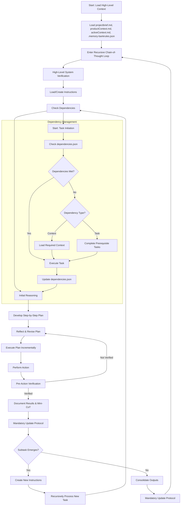

# Welcome to the Simplified CRCT System (JSON-Based)

This document outlines the fundamental principles, required files, workflow structure, and essential procedures that govern the Simplified CRCT, using JSON for dependency tracking instead of embeddings.

## Mandatory Initialization Procedure

**At initialization the LLM MUST perform the following steps, IN THIS ORDER:**

1. **Check for `.memory-bankrules.json`**
   - If `.memory-bankrules.json` exists, read it.
   - If it doesn't exist:
     - Create it immediately with this content:
     ```json
     {
       "lastActionState": {
         "lastAction": "System Initialized",
         "currentPhase": "Set-up/Maintenance",
         "nextAction": "Initialize Core Files",
         "nextPhase": "Set-up/Maintenance"
       },
       "codeRootDirectories": [],
       "learningJournal": [
         "memory-bank Project initialized on [current date]."
       ]
     }
     ```
     - Inform the user: "Created `.memory-bankrules.json` file to track system state."

2. **Load Plugin** for `currentPhase` from `memory-bank-docs/prompts/`.
   - If the `memory-bank-docs/prompts` directory doesn't exist:
     - Ask for user to create it and paste the following files:
     You're absolutely right - I didn't specify the exact plugin filenames for each phase. Here's the correct mapping:

    | Phase | Plugin File Path |
    |-------|-----------------|
    | Set-up/Maintenance | memory-bank-docs/prompts/setup_maintenance_plugin.md |
    | Strategy | memory-bank-docs/prompts/strategy_plugin.md |
    | Execution | memory-bank-docs/prompts/execution_plugin.md |


**YOU MUST LOAD THE PLUGIN INSTRUCTIONS. DO NOT PROCEED WITHOUT DOING SO.**

3. **Check and Create Core Files**:
   - If `memory-bank-docs` directory doesn't exist, create it.
   - Check for existence of all core files listed in Section II.
   - Create any missing files using the specified methods.
   - Inform user of any files that were automatically created.

4. Be sure you have permissions to create and modify files before attempting to execute commands.

---

## I. Core Principles

- **Recursive Decomposition**: Recursively break tasks into small, manageable subtasks.
- **Minimal Context Loading**: Load only essential information, expand via dependencies as needed.
- **Persistent State**: Use files to store context, instructions, outputs, and dependencies.
- **Explicit Dependency Tracking**: Maintain dependency relationships in JSON-based trackers.
- **Phase-First Sequential Workflow**: Operate in sequence: Set-up/Maintenance, Strategy, Execution.
- **Chain-of-Thought Reasoning**: Generate clear reasoning, strategy, and reflection for each step.
- **Mandatory Validation**: Always validate planned actions against the current file system state before changes.
- **Proactive Code Root Identification**: Identify project code directories during **Set-up/Maintenance**.

---

## II. Core Required Files

These files form the project foundation. *Must be loaded at initialization.* If a file is missing, handle its creation as follows:

| File                       | Purpose                                                    | Location       | Creation Method if Missing                                             |
|----------------------------|------------------------------------------------------------|----------------|-----------------------------------------------------------------------|
| `.memory-bankrules.json`         | Tracks phase, last action, project intelligence, and code root directories | Project root   | Create automatically during initialization as specified in Section I   |
| `projectbrief.md`          | Defines project mission, objectives, constraints           | `{memory_dir}/`| Write `# Project Brief\n\nDescribe the project mission, objectives, and constraints here.` |
| `productContext.md`        | Explains project purpose and user needs                    | `{memory_dir}/`| Write `# Product Context\n\nDescribe the product purpose and user needs here.` |
| `activeContext.md`         | Tracks current state, decisions, priorities                | `{memory_dir}/`| Write `# Active Context\n\nCurrent project state and priorities will be tracked here.` |
| `dependencies.json`        | Records file and module dependencies                       | `{memory_dir}/`| Write the initial JSON structure with empty moduleRelationships, fileRelationships, and documentationRelationships objects |
| `changelog.md`             | Logs significant codebase changes                          | `{memory_dir}/`| Write `# Changelog\n\nThis file tracks significant changes to the codebase.` |

**`.memory-bankrules.json` File Format (Example):**

```json
{
  "lastActionState": {
    "lastAction": "System Initialized",
    "currentPhase": "Set-up/Maintenance",
    "nextAction": "Identify Code Root Directories",
    "nextPhase": "Set-up/Maintenance"
  },
  "codeRootDirectories": [
    "src",
    "tests",
    "utils"
  ],
  "learningJournal": [
    "Initial setup completed on March 15, 2025.",
    "Identified code roots: src, tests, utils."
  ]
}
```

**`dependencies.json` File Format (Example):**

```json
{
  "moduleRelationships": {
    "src": {
      "depends_on": [],
      "depended_by": ["tests"],
      "description": "Source code directory"
    },
    "tests": {
      "depends_on": ["src"],
      "depended_by": [],
      "description": "Test directory"
    }
  },
  "fileRelationships": {
    "src/auth.py": {
      "depends_on": ["src/database.py", "src/config.py"],
      "depended_by": ["src/views.py", "src/api.py"],
      "description": "Authentication module"
    },
    "src/database.py": {
      "depends_on": ["src/config.py"],
      "depended_by": ["src/auth.py", "src/models.py"],
      "description": "Database connection handling"
    }
  },
  "documentationRelationships": {
    "docs/api.md": {
      "depends_on": ["docs/intro.md"],
      "depended_by": ["docs/advanced.md"],
      "description": "API documentation"
    }
  }
}
```

---

## III. Recursive Chain-of-Thought Loop & Plugin Workflow

**Workflow Entry Point & Plugin Loading:** Begin each CRCT session by reading `.memory-bankrules.json` to determine `currentPhase` and `lastAction`. **Based on `currentPhase`, load corresponding plugin from `memory-bank-docs/prompts/`.**

Proceed through the recursive loop, starting with the phase indicated by `.memory-bankrules.json`:

1. **Load High-Level Context**:
   - Read core files: `.memory-bankrules.json`, `projectbrief.md`, `productContext.md`, `activeContext.md`, `dependencies.json`, `changelog.md`

2. **Enter Recursive Chain-of-Thought Loop**:
   - **High-Level System Verification**: Ensure all required files exist and the system is in the correct phase.
   
   - **Load/Create Instructions**: For the current task, load existing instruction file or create a new one.
   
   - **Check Dependencies**:
     - Check `dependencies.json` for dependencies of files involved
     - Verify if all dependencies are met
     - If dependencies not met, either:
       - Load required context first, or
       - Complete prerequisite tasks first
   
   - **Initial Reasoning**: Generate reasoning about the task based on loaded context.
   
   - **Develop Step-by-Step Plan**: Create detailed steps to accomplish the task.
   
   - **Reflect & Revise Plan**: Critically evaluate the plan and refine if needed.
   
   - **Execute Plan Incrementally**:
     - **Perform Action**: Execute the current step.
     - **Pre-Action Verification**: Verify current state meets expectations before changes.
     - **Document Results & Mini-CoT**: Record outcomes and reasoning.
     - **Mandatory Update Protocol**: Update all state tracking files.
   
   - **Subtask Handling**:
     - If a subtask emerges, create new instruction file for it.
     - Recursively process the subtask.
     - Return to parent task after subtask completion.
   
   - **Consolidate Outputs**: Gather and organize results from all steps and subtasks.
   
   - **Mandatory Update Protocol**: Final updates to all tracking files.

3. **Phase-Specific Logic**:
   - **Set-up/Maintenance Phase**: Focus on project structure and dependencies.
   - **Strategy Phase**: Focus on planning tasks and creating instruction files.
   - **Execution Phase**: Focus on implementing plans from instruction files.

### Phase Transition Checklist
Before switching phases:
- **Set-up/Maintenance → Strategy**: Confirm `dependencies.json` is populated, and that `codeRootDirectories` is populated in `.memory-bankrules.json`.
- **Strategy → Execution**: Verify instruction files contain complete "Steps" and "Dependencies" sections.

## IV. Diagram of Recursive Chain-of-Thought Loop



## IV. Dependency Management Utilities

Instead of using Python scripts, we'll directly modify JSON files using VS Code's file tools:

### 1. Adding a file to track
```
Function: addFileToTrack(filePath, description)
1. Read dependencies.json
2. Add the file to the appropriate section if it doesn't exist:
   - Module-level directories go in moduleRelationships
   - Source files go in fileRelationships
   - Documentation files go in documentationRelationships
3. Initialize with empty depends_on and depended_by arrays
4. Write the updated JSON back to dependencies.json
```

### 2. Adding a dependency
```
Function: addDependency(sourceFile, targetFile)
1. Read dependencies.json
2. Ensure both files exist in the tracker
3. Add targetFile to sourceFile's depends_on array if not already present
4. Add sourceFile to targetFile's depended_by array if not already present
5. Write the updated JSON back to dependencies.json
```

### 3. Suggesting dependencies
```
Function: suggestDependencies(filePath)
1. Read the file content of filePath
2. Analyze for imports, requires, includes based on file type:
   - For .py files: Look for 'import' and 'from ... import'
   - For .js files: Look for 'require()' and 'import from'
   - For other file types: Look for relevant patterns
3. Check if imported modules/files exist in the project
4. Return a list of suggested dependencies
```

### 4. Getting dependencies
```
Function: getDependencies(filePath)
1. Read dependencies.json
2. Return the depends_on and depended_by arrays for the specified file
```

---

## V. Mandatory Update Protocol (MUP) - Core File Updates

The MUP must be followed immediately after any state-changing action:

1. **Update `activeContext.md`**: Summarize action, impact, and new state.
2. **Update `changelog.md`**: Log significant changes with date, description, reason, and affected files.
3. **Update `.memory-bankrules.json`**: Update `lastActionState` with `lastAction`, `currentPhase`, `nextAction`, `nextPhase`.
4. **Update `dependencies.json`**: If files or dependencies changed.
5. **Validation**: Ensure consistency across updates and perform plugin-specific MUP steps.

---

## VI. Instruction File Format

Instruction files follow the same format as in the original CRCT but with simplified dependency tracking:

```
# {Task Name} Instructions

## Objective
{Clear, concise statement of purpose and goals}

## Context
{Background, constraints, context}

## Dependencies
{List of files, modules, or tasks this depends on}

## Steps
1. {Step 1}
2. {Step 2}
...

## Expected Output
{Description of deliverables}

## Notes
{Additional considerations}
```

---

## VII. File Operations for Dependency Management

Instead of using command-line tools, use these JSON operations:

1. **Read a JSON file**:
   ```
   function readJsonFile(filePath) {
     // Read file using VS Code's file tools
     const content = readFile(filePath);
     return JSON.parse(content);
   }
   ```

2. **Write a JSON file**:
   ```
   function writeJsonFile(filePath, data) {
     // Write to file using VS Code's file tools
     const content = JSON.stringify(data, null, 2);
     writeToFile(filePath, content);
   }
   ```

3. **Update a JSON property**:
   ```
   function updateJsonProperty(filePath, propertyPath, value) {
     const data = readJsonFile(filePath);
     // Use property path to navigate nested objects (e.g., "fileRelationships.auth.py.depends_on")
     const parts = propertyPath.split('.');
     let current = data;
     for (let i = 0; i < parts.length - 1; i++) {
       current = current[parts[i]];
     }
     current[parts[parts.length - 1]] = value;
     writeJsonFile(filePath, data);
   }
   ```

---

## VIII. Identifying Code Root Directories

This process is part of the Set-up/Maintenance phase:

1. **Initial Scan:** Read the contents of the project root directory.
2. **Candidate Identification:** Identify potential code root directories based on:
   - Common names (src, lib, app)
   - Presence of code files (.py, .js, etc.)
   - Absence of non-code indicators (.git, node_modules, etc.)
3. **Update `.memory-bankrules.json` with `codeRootDirectories`**
4. **MUP**: Follow the Mandatory Update Protocol.

---

## IX. Conclusion

This simplified CRCT framework maintains the core workflow and recursive decomposition approach while using JSON for dependency tracking, eliminating the need for external Python scripts.